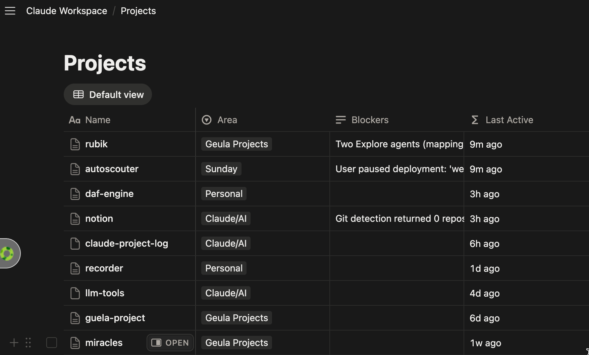
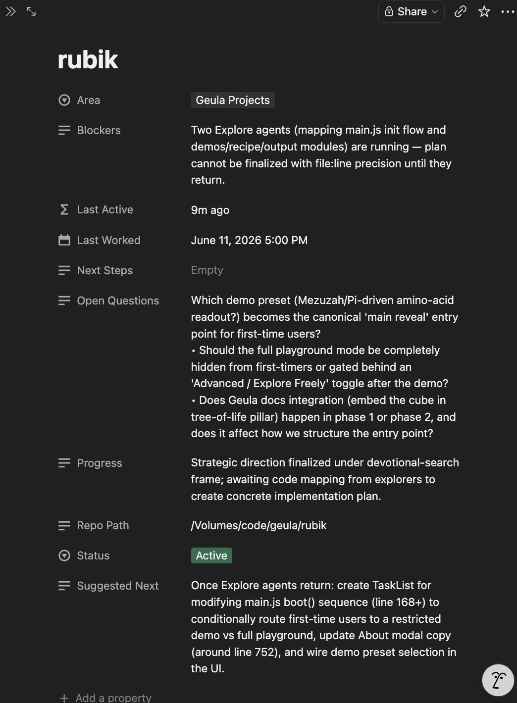

# claude-project-log

A Claude Code plugin that automatically tracks your project activity. A background job reads Claude Code transcripts every 20 minutes, synthesizes a per-project progress delta using claude-haiku, appends timestamped entries to a Notion Projects board, and injects a `STATE.md` resume card at the start of every new session — so you never lose context when switching between projects.

Works on macOS and Linux — no background daemon, no launchd, no cron. Scheduling is handled entirely by Claude Code hooks (`Stop` + `PostToolUse` + `SessionEnd`) that fire as you work.

## Screenshots

The Notion Projects board, sorted by **Last Worked** with a glanceable **Last Active** ("time ago") column:



A project's detail page — auto-maintained **Progress**, **Open Questions**, **Suggested Next** (Resume Here), **Status**, and **Last Worked**:



## Prerequisites

Before running setup, you need:

**1. bun installed**

```bash
curl -fsSL https://bun.sh/install | bash
```

**2. claude CLI installed and logged in**

```bash
npm install -g @anthropic-ai/claude-code
claude  # then /login
```

The sweeper calls `claude -p` headlessly to run synthesis. It must be on your PATH.

**3. A Notion internal integration token**

Go to https://www.notion.so/my-integrations, click "New integration", give it a name, and copy the token. It starts with `ntn_` or `secret_`.

**4. A Notion parent page shared with that integration**

Create or choose a page in Notion where the Projects database will live. Then:
- Open the page in Notion
- Click the `...` menu (top right) > Connections > select your integration

To get the page ID: copy the URL. The page ID is the 32-character hex string after the last `/` (and before any `?`). Example:
```
https://www.notion.so/My-Workspace-abc123def456...
                                    ^^^^^^^^^^^^^^^^  ← page ID
```

**5. (Recommended) An Anthropic API key**

`ANTHROPIC_API_KEY` enables reliable headless synthesis. Without it, the sweeper uses your claude CLI subscription credentials, which can be unreliable in non-interactive contexts. See the Auth section below.

## Installation

```bash
# In Claude Code, run:
/plugin marketplace add yehosef/claude-project-log
/plugin install claude-project-log

# Then run the interactive setup:
/project-log-setup
```

Or run setup directly:

```bash
bun ~/.claude/plugins/claude-project-log/lib/setup.ts
```

Setup will:
1. Create `~/.claude/projects-log/` with all required subdirectories
2. Copy the runtime source files into place (including `tick.sh`)
3. Prompt for your Notion token, parent page ID, and optional API key
4. Write `~/.claude/projects-log/.env` (mode 0600)
5. Create a "Projects" Notion database under your parent page
6. Add `SessionStart`, `Stop`, `PostToolUse`, and `SessionEnd` hooks to `~/.claude/settings.json`

## How scheduling works

Setup installs heartbeat hooks in `~/.claude/settings.json`, all running the same `tick.sh`:

- **`Stop`** — fires at the end of every turn (the workhorse: the work you just did is already on disk).
- **`PostToolUse`** — fires after each tool call, which gives coverage *during* long single-turn autonomous runs (where `Stop` wouldn't fire until the run ends).
- **`SessionEnd`** — runs `tick.sh force`, which **bypasses the 20-minute gate** so the *last* work of a session is always captured. After a session ends there are no more ticks, so without this the final edits would wait until the next session's first tick.

`tick.sh` is a fast bash script that checks whether at least 20 minutes have elapsed since the last sweep (or `force` to ignore the gate). If due, it writes an atomic timestamp and spawns `synth.ts --sweep` detached in the background (`nohup ... &`), then returns immediately. Your session is never blocked.

All hooks share **one global, idempotent gate** (a single timestamp file + the lock below), so it still sweeps at most once per interval no matter how many hooks fire — that's why it's safe to attach `tick.sh` to multiple hook types.

The authoritative concurrency guard is `synth.ts`'s O_EXCL file lock with pid liveness and 10-minute stale reclaim — `tick.sh` is only a cheap pre-filter that avoids spawning on every turn.

**Reliability:** every Notion call retries with backoff on network errors (`ECONNRESET`, socket close) and `429`/`5xx` — a dropped connection never crashes a sweep. A sweep also releases its lock on a hard crash (uncaught-error / unhandled-rejection handlers), and any lock left by a killed process is reclaimed after 10 minutes — so a single failure can't freeze future syncs. Per-project watermarks mean a project that errors is simply retried on the next sweep; nothing is lost.

You can adjust the interval via the `PROJECTLOG_INTERVAL` environment variable (in seconds, default 1200):

```bash
# In your shell config (e.g. ~/.zshrc or ~/.bashrc):
export PROJECTLOG_INTERVAL=600   # sweep every 10 minutes
```

## Tracking model: opt-OUT (track by default)

Every project you actually work in (at least 3 assistant turns of activity) auto-registers and starts logging to Notion. You don't approve anything. To stop a project from being tracked, opt it out:

```bash
bun ~/.claude/projects-log/cli.ts ignore <path>   # hard-block a dir/tree
```

Pre-seeded blocks in `ignore.json`: `/tmp`, `/private/tmp`, and the synth scratch dir. Edit that file to add or remove blocks.

Defense in depth: even inside a tracked project, individual transcript lines are routed by their own `cwd`, so if you `cd` into an ignored directory mid-session, those lines are dropped and never sent to Notion. The "at least 3 turns" floor only skips barely-touched throwaway directories — it is a junk filter, not an approval gate.

## Commands

```bash
bun ~/.claude/projects-log/cli.ts status           # show tracked projects + pending
bun ~/.claude/projects-log/cli.ts sweep            # run sweep now
bun ~/.claude/projects-log/cli.ts sweep --dry-run  # see what would happen, no writes
bun ~/.claude/projects-log/cli.ts sync .           # force-synthesize current project
bun ~/.claude/projects-log/cli.ts register .       # register current dir
bun ~/.claude/projects-log/cli.ts register . --area "Work"
bun ~/.claude/projects-log/cli.ts ignore .         # opt OUT: hard-block this dir/tree
bun ~/.claude/projects-log/cli.ts unregister .     # remove from registry (stops logging)
bun ~/.claude/projects-log/cli.ts pending          # dirs seen but below the 3-turn floor
bun ~/.claude/projects-log/cli.ts pull .           # refresh Next Steps + STATE.md
```

## How it works

1. **Heartbeat hooks** (`Stop` after every turn + `PostToolUse` after each tool call + `SessionEnd` forcing a final sweep) fire `tick.sh` — it cheaply checks elapsed time and spawns the sweep detached if due. A shared, idempotent gate means at most one sweep per interval.
2. **Discovery**: reads recent `.jsonl` transcript files from `~/.claude/projects/`, counts assistant turns per unique `cwd`, deduplicates by git root
3. **Auto-register**: directories with ≥3 turns get a Notion page created and enter the registry
4. **Synthesis**: for each registered project, collects new transcript lines since the last sweep, redacts secrets, prepends git context, and calls `claude -p --model claude-haiku-4-5` to produce a JSON summary
5. **Notion write**: appends a timestamped entry to a `Log YYYY-MM` sub-page, updates Progress / Suggested Next / Open Questions / Blockers / Status / Last Worked properties on the project page
6. **STATE.md**: writes `~/.claude/projects-log/state/<slug>/STATE.md` with resume context
7. **SessionStart hook**: on every new Claude Code session, reads the registry, finds the matching project for the current directory, and prints STATE.md as context

## What each project captures

| Field | Description |
|-------|-------------|
| Progress | One-line current state |
| Suggested Next | The ONE concrete next action (specific file/command/function) |
| Open Questions | Unresolved decisions and the WHY behind notable choices |
| Blockers | What is stalling progress (conservative — only real blockers) |
| Status | Active / Paused / Idea / Done — auto-managed except Done and Idea |
| Last Worked | Full datetime of most recent synthesis |
| Last Active | Formula column: glanceable relative time ("2h ago", "3w ago") |
| Monthly logs | Sub-pages (Log YYYY-MM) with timestamped headings and bullets |

Status auto-management: set to Active on real activity; auto-set to Paused after 14 days of inactivity. Done and Idea are user-owned and never automatically changed.

**Notion board tip:** open the Projects database → Sort → Last Worked → Descending so the most recently active project appears on top. The `Last Active` formula column gives you a glanceable relative time alongside the precise `Last Worked` timestamp.

## Notion schema

The setup script creates a "Projects" database with these properties:

| Property | Type | Notes |
|----------|------|-------|
| Name | title | Project name (from git root dir name) |
| Status | select | Active / Paused / Idea / Done |
| Area | select | Personal / Work / Infrastructure / Ideas (customizable) |
| Next Steps | rich_text | User-owned; never overwritten by sweeper |
| Suggested Next | rich_text | Sweeper-owned resume hint |
| Progress | rich_text | One-line current state |
| Open Questions | rich_text | Decisions in flight |
| Blockers | rich_text | What is blocking progress |
| Repo Path | rich_text | Absolute path to project root |
| Last Worked | date | Full datetime of last synthesis |
| Last Active | formula | Relative time ("2h ago", "3d ago") computed from Last Worked |

## Auth

The sweeper needs either:

1. `ANTHROPIC_API_KEY` in `~/.claude/projects-log/.env` — recommended, metered at Haiku rates, deterministic (no keychain dependency).
2. Claude subscription credentials in `~/.claude/.credentials.json` seeded from keychain — works interactively but can be unreliable from non-interactive contexts. If you use this path, trigger a sweep once from an interactive terminal to prime the credentials.

The `NOTION_TOKEN` must always be present in `.env` (mode 0600).

## Privacy

- Secrets are redacted from transcript lines before they are sent to the model or written to Notion (API keys, tokens, JWTs, high-entropy strings)
- The model receives a ~30KB capped digest of recent assistant/user messages, not raw tool outputs
- Everything runs locally on your machine; your Notion workspace is the only external service
- You choose your own integration and database — no data goes through any third-party relay

## File layout

```
~/.claude/projects-log/
├── .env                      # NOTION_TOKEN + ANTHROPIC_API_KEY (chmod 600)
├── notion.json               # {projects_db_id, projects_db_url}
├── registry.json             # slug → {cwd, name, area, notion_page_id, created}
├── pending.json              # dirs seen but below 3-turn threshold
├── ignore.json               # opt-out hard-block list
├── config.json               # {code_roots: []} — legacy; currently unused
├── global-state.json         # {lastSweepAt}
├── .lock                     # sweep mutex (ephemeral)
├── .last-sweep               # unix timestamp of last sweep (used by tick.sh)
├── .tick.lock                # mkdir-based mutex for tick.sh (ephemeral)
├── .scratch/                 # temp dir for claude -p invocations
├── tick.sh                   # heartbeat gate (spawns sweep when ≥20 min elapsed)
├── state/
│   ├── <slug>.json           # per-project byte offsets, caches, recent entries
│   └── <slug>/STATE.md       # injected at session start
├── env.ts  notion-api.ts  transcript.ts  registry.ts  synth.ts  cli.ts  hook.ts
```

## Uninstall

```bash
# Remove the hooks from ~/.claude/settings.json:
# Delete the SessionStart entry containing "hook.ts session-start"
# Delete the Stop, PostToolUse, and SessionEnd entries containing "tick.sh"

# Remove all data:
rm -rf ~/.claude/projects-log
```

## License

BSD 2-Clause
